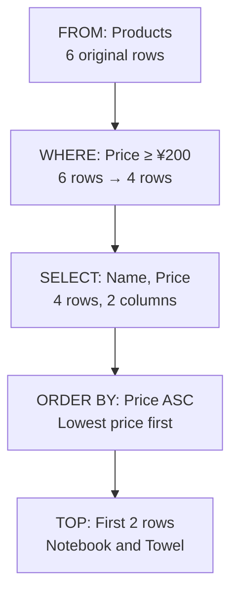
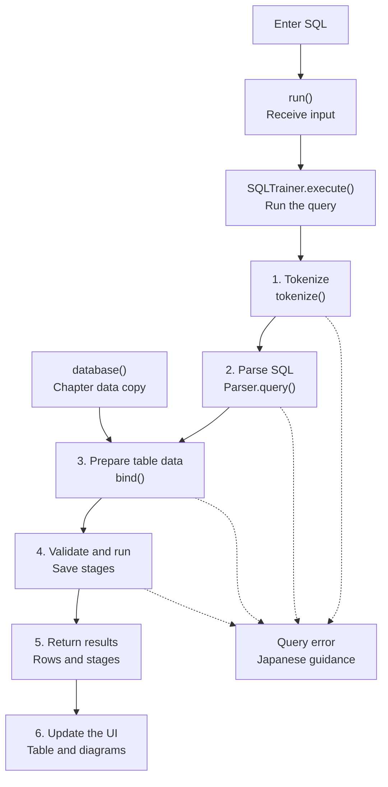
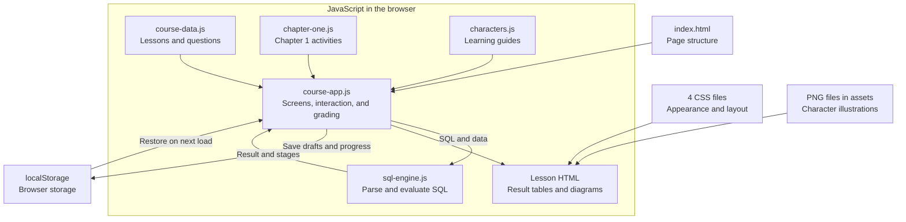
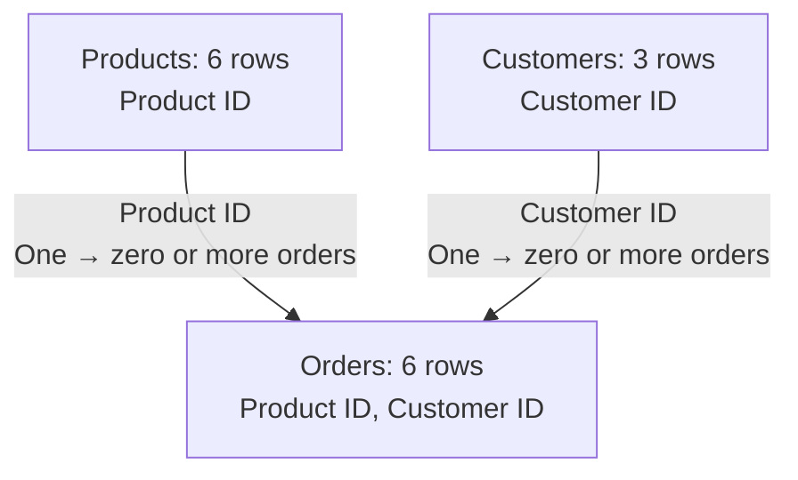
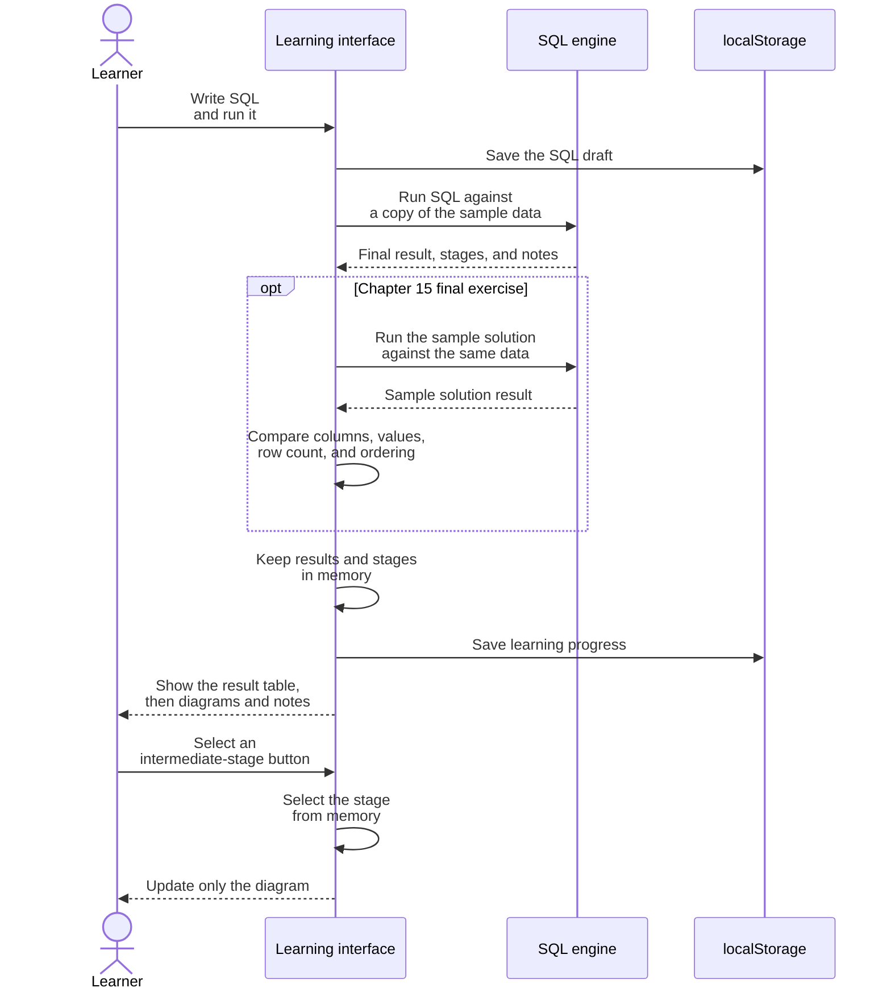

# SQL First Steps — SQLのきほん

**Explore the diagrams, write SQL, and see what changes.**

**Open the course:** [https://tsurumakishunta.github.io/sql-no-kihon/](https://tsurumakishunta.github.io/sql-no-kihon/)

**Language:** [日本語](README.md) | English

SQL First Steps is a beginner-friendly course for learning how to write SQL for SQL Server. Its 15 chapters start with rows and columns, then introduce filtering, sorting, aggregation, and joins between tables.

Carmelo, a gentle chick, and Cornalina, a caring older-sister figure, guide learners through diagrams and familiar sample data.

This README provides the full project introduction and technical explanation in English. **The course interface, lesson text, character dialogue, and sample table and column names are in Japanese.** The SQL examples below retain the Japanese identifiers used by the course, so they can be run in its simulator.


## Who this course is for

- People encountering SQL or databases for the first time.
- People who find it difficult to picture the result of a SQL query.
- People who want to learn by writing SQL as they read the explanations.
- People who want to practice the basics of `SELECT` at their own pace.

## What the course offers

- **See how tables change.** Diagrams show selected columns, matching rows, aggregation groups, and relationships between tables.
- **Change the SQL and try it.** Edit queries against sample products, orders, and customers, then run them to see how the results change.
- **Start over whenever you need.** The 「初期値に戻す」 (Reset to initial values) button restores the initial SQL and clears its execution result, making it easy to experiment.
- **Review with quizzes and exercises.** The course contains 46 lessons and 45 review questions. Three final exercises ask learners to build queries for specific goals.
- **Continue where you left off.** Learning progress and SQL drafts are saved in the browser. Choose 「つづきから」 (Continue) to resume.

## What you will learn

| Chapter | Topic | What you will practice |
| --- | --- | --- |
| 1 | What is a database? | Understand tables, rows, and columns, and get a feel for retrieving information from a table. |
| 2 | Write your first SQL query | Use `SELECT` and `FROM` to choose the columns you want to see. |
| 3 | Find matching rows | Use `WHERE` to keep the rows you need. |
| 4 | Combine conditions | Express multiple conditions with `AND`, `OR`, and parentheses. |
| 5 | Explore more ways to search | Use `IN`, `BETWEEN`, and `LIKE` to specify lists of values, ranges, and text patterns. |
| 6 | Sort results and show the first rows | Use `ORDER BY` and `TOP` to control the order and number of rows shown. |
| 7 | Shape the query result | Use `AS`, calculations, and `DISTINCT` to name output columns and remove duplicates. |
| 8 | What if a value is missing? | Understand `NULL` and find rows with missing values. |
| 9 | Count and summarize data | Aggregate data with `COUNT`, `SUM`, `AVG`, `MIN`, and `MAX`. |
| 10 | Summarize by category | Use `GROUP BY` to calculate counts and totals for each group. |
| 11 | Filter grouped results | Apply conditions to groups after aggregation with `HAVING`. |
| 12 | Connect two tables | Combine matching data with `INNER JOIN`. |
| 13 | Keep rows without a match | Use `LEFT JOIN` to include rows even when the other table has no matching data. |
| 14 | Writing order and logical processing order | Follow intermediate tables to understand the logical order in which SQL produces a result. |
| 15 | Build your own queries | Combine conditions, aggregation, and joins in three final exercises. |

## How to learn

1. Choose 「はじめる」 (Start) on the title screen, then select a chapter. If you are new to SQL, start with Chapter 1 and build your understanding in order.
2. Read the characters' explanations to understand the tables and the SQL concepts.
3. Write SQL, press 「実行」 (Run), and inspect the result displayed below. Try changing a column or condition, and predict the result before running the query.
4. Use the diagrams and notes below the result to understand why it looks that way. If you get stuck, choose 「初期値に戻す」 (Reset to initial values) to return to the example.
5. Check your understanding with the quiz at the end of each chapter, then try the final exercises.

## Your learning guides

**Carmelo — カルメロ**

A gentle, quiet chick wearing a white headband. Carmelo is the course's main guide, explaining unfamiliar words and SQL concepts one step at a time.

**Cornalina — コルナリーナ**

A calm, caring guide with an older-sister manner. She appears at key points and common stumbling blocks to offer a little extra help.

## Using the course

The course runs on HTML, CSS, and JavaScript, without installing SQL Server. You can also open `index.html` inside a downloaded `dist` folder in your browser. Keep the entire `dist` folder together, because the page uses its images and other files.

Queries run in an educational simulator using sample data. The focus is retrieving data with `SELECT`. The simulator does not reproduce every SQL Server syntax feature or behavior. Adding, updating, or deleting data, and configuring or operating a database server, are outside the course's scope.

Learning records stay in the browser you are using. They do not transfer to another browser or device, and clearing the browser's stored site data removes them.

## How does SQL produce a result?

SQL is a language for telling a database **which table to use, which conditions to apply, and what information to return**. A `SELECT` statement describes the result you want. The SQL engine does the work of examining the tables and assembling that result.

### Example: return the two cheapest products costing at least ¥200

```sql
SELECT TOP (2) 商品名, 価格
FROM 商品
WHERE 価格 >= 200
ORDER BY 価格 ASC;
```

Here, `商品` means “Products,” `商品名` means “Product name,” and `価格` means “Price.” The example uses the course's original identifiers. Follow what it means using the sample data:



After filtering and sorting, the four remaining products are Notebook (¥250), Towel (¥600), Mug (¥900), and Water bottle (¥1,500). `TOP (2)` keeps the first two. The diagram uses English labels; the simulator returns the original Japanese column names and values below. `ノート` means “Notebook,” and `タオル` means “Towel.”

| 商品名 | 価格 |
| --- | ---: |
| ノート | 250 |
| タオル | 600 |

Although `SELECT` and `TOP` appear at the start of the query, it helps to understand its meaning by beginning with the source table. This **conceptual order in which the result is formed** is called *logical processing order*. Products that do not appear in the result still remain in the original table.

### Filtering, grouping, and joining transform tables in stages

The following table shows the order used by this simulator to produce results. It skips clauses that the query does not use. When a query aggregates without `GROUP BY`, it treats all the applicable rows as one group.

| Step | SQL clause or operation | What it does to the table | How this simulator handles it |
| --- | --- | --- | --- |
| 1 | `FROM` | Prepare the source table. | Look up the table name and create column metadata and copies of its rows. |
| 2 | `JOIN` and `ON` | Connect rows that satisfy the join condition. | Examine combinations of left and right rows. For `LEFT JOIN`, fill the right-hand columns with `NULL` when there is no match. |
| 3 | `WHERE` | Keep rows that satisfy the condition. | Evaluate the condition for each row and filter with `filter()`. |
| 4 | `GROUP BY` and preparation for aggregation | Collect rows with the same grouping values. | Create groups in a `Map`, retaining each group's original rows. |
| 5 | `HAVING` | Keep groups that satisfy the condition. | Evaluate conditions using values such as each group's total or count. |
| 6 | `SELECT` | Produce columns and calculated values. | Use `map()` to create output values and apply `AS` aliases. |
| 7 | `DISTINCT` | Collapse identical result rows into one. | Use a `Set` to remember combinations of values already returned. |
| 8 | `ORDER BY` | Sort the result. | Use `sort()` to compare the specified columns or expressions. |
| 9 | `TOP` | Take the requested number of rows from the beginning. | Use `slice()` to return the first part of the result. |

In conditions such as `WHERE`, a `NULL` value can make the outcome *unknown*. The simulator keeps only rows whose condition evaluates explicitly to *true*. Aggregate functions calculate values from the group's rows when needed by clauses such as `HAVING` or `SELECT`.

In real SQL Server, the engine uses information such as statistics to choose an efficient way to process the query. **Logical processing order does not necessarily match the order in which the computer physically performs the work.** The course diagrams explain what a query means. See [Microsoft Learn: Logical processing order of SELECT](https://learn.microsoft.com/en-us/sql/t-sql/queries/select-transact-sql) and [Query processing architecture](https://learn.microsoft.com/en-us/sql/relational-databases/query-processing-architecture-guide).

## How SQL runs inside the browser

The course contains a small **SQL interpreter** written in JavaScript. An interpreter reads an input statement and performs operations according to its meaning. Here, it runs SQL against sample data held in the browser.

### From typed text to a result table



1. **Tokenize: split the text into parts.** For example, `WHERE 価格 >= 200` becomes the tokens `WHERE`, `価格`, `>=`, and `200`. Whitespace and comments are skipped.
2. **Parse: work out the role of each part.** Identify the table name, output columns, conditions, and sort order. Conditions and calculations are stored in tree-like structures that represent parentheses and operator precedence.
3. **Prepare tables and column metadata.** Find the requested tables, and prepare column names, types, table aliases, and source rows.
4. **Validate and evaluate each clause.** Filter rows, create groups, calculate values, and sort. Column, type, and aggregation rules are checked where they are needed during processing. The engine also detects nonexistent columns and references that are ambiguous between tables.
5. **Collect the result and intermediate stages.** Return the final table together with rows, columns, and explanations from each stage.
6. **Render HTML tables and diagrams.** The interface receives the result, displays the final table first, and places its explanations below.

For example, the parsed information can be pictured like this. In the implementation, conditions and column expressions are represented by more detailed objects.

```text
Source table       商品 (Products)
Output columns     商品名 (Product name), 価格 (Price)
Filter             価格 >= 200
Sort order         価格 in ascending order
Row limit          2
```

The interpreter does not convert the input SQL to JavaScript code and run it with `eval()`. It evaluates the parsed objects according to the simulator's rules. SQL execution also does not make requests to an external database or API.

## Technical architecture

### Overall architecture

Application processing takes place entirely in the browser. HTML provides the page structure, CSS controls its appearance, and JavaScript manages lessons, SQL execution, and progress storage.



| Technology or file | Responsibility |
| --- | --- |
| [index.html](dist/index.html) | Provides the header, menus, learning area, chapter navigation, and dialog structure. |
| [styles.css](dist/styles.css) | Styles the graph-paper background, text, buttons, tables, and other basic elements. |
| [course.css](dist/course.css) | Styles the SQL editor, execution results, intermediate stages, and quizzes. |
| [learning.css](dist/learning.css) | Styles the chapter list, vertically arranged lessons, collapsible navigation, and character displays. |
| [start-screen.css](dist/start-screen.css) | Arranges the game-style title screen and full-body illustration. |
| [course-data.js](dist/course-data.js) | Holds lesson text, SQL examples, review questions, and exercise solutions for Chapters 2–15. |
| [chapter-one.js](dist/chapter-one.js) | Provides Chapter 1's interactive introduction to databases, tables, rows, and columns, and its quiz. |
| [characters.js](dist/characters.js) | Combines the images, names, and explanatory dialogue for Carmelo and Cornalina. |
| [course-app.js](dist/course-app.js) | Coordinates navigation, SQL editing and execution, result rendering, diagram changes, quizzes, grading, and storage. |
| [sql-engine.js](dist/sql-engine.js) | Provides the sample data and `SQLTrainer`, which parses and evaluates SQL. |
| [assets](dist/assets) | Contains the two character portraits and the title illustration. |
| Standard browser features | Handle interface interaction, URL-based navigation, and `localStorage`. |
| [preview.cjs](preview.cjs), optional | A Node.js server for viewing the course locally. It serves files; it does not process SQL. |

The HTML lists JavaScript files in this order: `characters.js` → `sql-engine.js` → `course-data.js` → `chapter-one.js` → `course-app.js`. Each script uses `defer`, so they execute in that order after the HTML has been parsed. Chapter 1's SQL editor also uses the shared engine through `course-app.js`. See [MDN: The script element's defer attribute](https://developer.mozilla.org/en-US/docs/Web/HTML/Reference/Elements/script#defer).

Navigation is represented by the part of the URL after `#`, such as `#home`, `#chapters`, or `#chapter-2/lesson-1`. JavaScript changes the displayed content without reloading the entire page. The application uses no UI framework or external CDN.

When opened as a website, the browser first receives HTML, CSS, JavaScript, and images from the hosting server. SQL parsing and evaluation then take place inside the browser. The same SQL engine runs when the course is opened from local files.

In browsers that support `document.modelContext`, the application also registers three operations: reading the course state, navigating to a chapter, and running SQL. The SQL operation uses the same `run()` function as the normal interface. Browsers without this integration can still use the buttons and input fields to access the course.

### Sample data structure and relationships

The data is stored in JavaScript objects in `sql-engine.js`. Each table has three properties: `columns` for column names, `types` for data types, and `rows` for an array of rows.

| Table | Rows | Columns, using the actual SQL identifiers |
| --- | ---: | --- |
| 商品 — Products | 6 | 商品ID, 商品名, カテゴリ, 価格, 在庫, メモ |
| 注文 — Orders | 6 | 注文ID, 商品ID, 個数, 顧客ID |
| お客さま — Customers | 3 | 顧客ID, 名前 |

The column names mean Product ID (`商品ID`), Product name (`商品名`), Category (`カテゴリ`), Price (`価格`), Stock (`在庫`), Note (`メモ`), Order ID (`注文ID`), Quantity (`個数`), Customer ID (`顧客ID`), and Name (`名前`).

The `メモ` (Note) column becomes available in Chapter 8, which introduces `NULL`. For Chapters 1–7, the engine supplies a Products table without this column.



For example, the notebook (`ノート`) has Product ID `1`, and the Orders table has two rows with Product ID `1`. Joining on Product ID pairs the notebook with each order, producing two result rows. This diagram describes relationships in the sample data. The simulator does not implement the creation or enforcement of database foreign key constraints.

`SQLTrainer.database(chapterNumber)` returns a copy of the original sample data. The execution engine also constructs rows for the result, so running `SELECT` repeatedly does not change the original course data.

### Data connecting result tables and diagrams

`SQLTrainer.execute(SQL, data)` returns the following information:

| Property | Contents | Used for |
| --- | --- | --- |
| `columns` | Column names in the final result. | Result table headings. |
| `rows` | Rows in the final result. | Result table values. |
| `stages` | Columns, rows, explanations, and source-row information at each stage. | The intermediate-table walkthrough. |
| `query` | The parsed SQL structure. | Checking settings such as the requested sort order. |
| `warnings` | Notes to help interpret the result. | Guidance such as the absence of `ORDER BY`. |
| `sourceTables` | Names of referenced tables. | Displaying the source tables. |

`stages` contains snapshots of processing along the way. The `origins` information tracks which rows in which source tables contributed to the result. At the `GROUP BY` stage, `groups` also records group membership. The interface uses this information to highlight retained rows and place rows belonging to the same group together in a box.

When a learner selects an intermediate-stage button, the interface switches between the saved `stages`. It does not need to execute SQL again, and the final result above stays unchanged. The aggregation diagram's count of grouped rows is an explanatory display, separate from the result columns selected by the SQL query.

The JOIN relationship diagram looks up orders matching the selected Product ID in the sample data. It helps explain connections through Product ID; it does not convert every possible join condition entered by the learner into a diagram.

### Grading, storage, and reset behavior



The final exercises compare the **execution results** of the learner's SQL and the sample solution. The SQL text itself does not have to match. Grading checks column names, column order, values, and row counts. If the sample solution has `ORDER BY`, the learner's query must also have `ORDER BY`, and the result rows must be in the same order. If the sample solution specifies no order, row order is ignored in the comparison. This grading does not prove that two queries are equivalent for every possible dataset.

| Information | Where it is stored | After reloading |
| --- | --- | --- |
| Original Products, Orders, and Customers data | In `sql-engine.js`. | The same sample data is prepared again. |
| Execution results, errors, and the currently displayed processing stage | In an in-memory `Map`. | Cleared; run the SQL again to see the result. |
| SQL drafts, completed lessons and chapters, quiz and exercise progress, current learning position, and navigation panel state | In `localStorage`, under `sql-kihon-course-v1`. | Restored when browser storage is available. |

「初期値に戻す」 (Reset to initial values) restores the lesson's initial SQL and clears its in-memory execution result, returning it to a state where it has not yet been run. Completed-learning records are retained. The course remains usable when `localStorage` is unavailable, but progress cannot be restored after reloading. Storage is separate for each browser and website origin.

### How this relates to real SQL Server

| Aspect | This course | Real SQL Server |
| --- | --- | --- |
| Where SQL runs | JavaScript inside the browser. | The SQL Server database engine. |
| Data | A small, fixed sample loaded into memory. | Data managed in a database. |
| Processing method | Step-by-step evaluation using educational rules. | An optimizer chooses an execution plan. |
| Scope | A single read-only `SELECT` statement using the features taught in the course. | A broad range of features, including reads, updates, and administration. |
| Compatibility | Reproduces basic syntax and selected data-type and `NULL` behavior. | Follows SQL Server's data types, collations, permissions, and other rules. |

The course engine does not implement execution-plan optimization, indexes, transactions, or persistent changes to the sample data. String comparisons and numeric precision are not fully compatible with SQL Server either. Its purpose is to make basic SQL concepts visible through input, results, and diagrams. The explanation of SQL Server processing draws on [Microsoft Learn's query processing architecture guide](https://learn.microsoft.com/en-us/sql/relational-databases/query-processing-architecture-guide).
