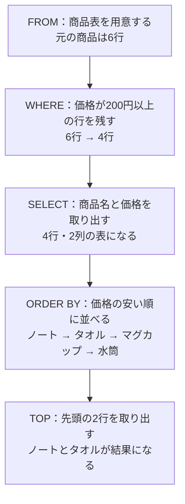
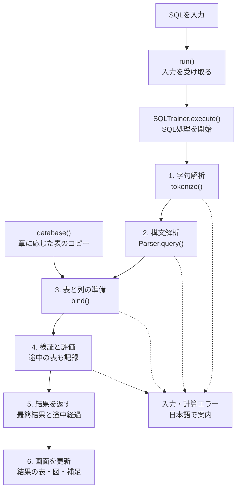
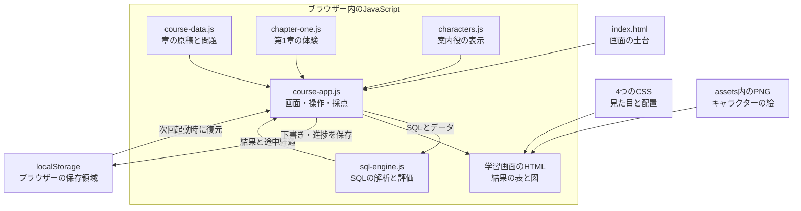
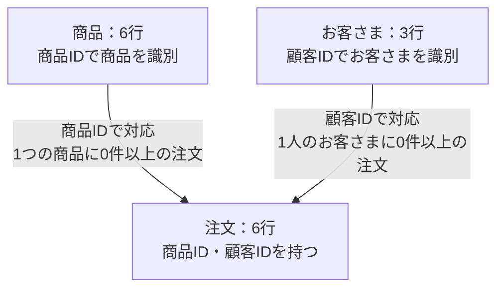
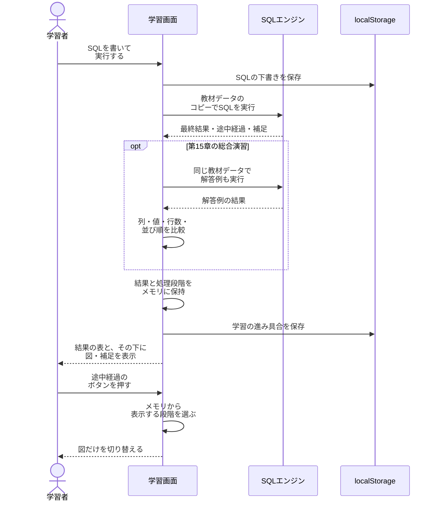

# SQLのきほん

**図を見て、SQLを書いて、結果を確かめる。**

SQL Serverで使うSQLの書き方を、基礎から少しずつ学べる初心者向け教材です。表の「行」と「列」を知るところから始めて、条件で絞る、並べ替える、集計する、複数の表をつなぐところまで、全15章で学びます。

ひよこの「カルメロ」と、お姉さん役の「コルナリーナ」が、図や身近なデータを使って学習を案内します。


## こんな方へ

- SQLやデータベースに初めて触れる方
- SQLを見ても、どのような結果になるのかイメージしにくい方
- 説明を読みながら、実際にSQLを書いて覚えたい方
- SELECTの基本を、自分のペースで練習したい方

## この教材の特徴

- **表の変化を図で確かめる** — 選んだ列や条件に合う行、集計のまとまり、表同士のつながりを見ながら学べます。
- **SQLを変えて試す** — 商品・注文・お客さまのサンプルデータを使い、SQLを書き換えて実行すると結果が変わります。
- **何度でもやり直せる** — 「初期値に戻す」でSQLと実行結果をリセットできるので、気軽に試せます。
- **クイズと演習で振り返る** — 全46レッスンと45問の復習クイズを収録。最後は3つの総合演習で、目的に合うSQLを組み立てます。
- **続きから学べる** — 学習の進み具合とSQLの下書きをブラウザーに保存し、「つづきから」で再開できます。

## 学べる内容

| 章 | テーマ | 学ぶこと |
| --- | --- | --- |
| 1 | データベースって何？ | テーブル・行・列を知り、表から情報を取り出す感覚をつかむ |
| 2 | はじめてのSQLを書こう | `SELECT`・`FROM`で、見たい列を選ぶ |
| 3 | 条件に合う行を探そう | `WHERE`で、必要な行を絞り込む |
| 4 | 条件を組み合わせよう | `AND`・`OR`・括弧で、複数の条件を表す |
| 5 | いろいろな探し方を覚えよう | `IN`・`BETWEEN`・`LIKE`で、候補・範囲・文字のパターンを指定する |
| 6 | 並べ替えと上位表示をしよう | `ORDER BY`・`TOP`で、表示する順番と件数を決める |
| 7 | 取り出す結果を整えよう | `AS`・計算・`DISTINCT`で、別名を付けたり重複を除いたりする |
| 8 | 値が入っていないときは？ | `NULL`の意味と、値が入っていない行の探し方を知る |
| 9 | 件数や合計を求めよう | `COUNT`・`SUM`・`AVG`・`MIN`・`MAX`で、データを集計する |
| 10 | 種類ごとに集計しよう | `GROUP BY`で、グループごとに件数や合計を求める |
| 11 | 集計した結果を絞ろう | `HAVING`で、集計後のグループに条件を付ける |
| 12 | 2つの表をつなごう | `INNER JOIN`で、対応するデータを組み合わせる |
| 13 | 相手がいない行も残そう | `LEFT JOIN`で、対応するデータがない行も取り出す |
| 14 | SQLを書く順番と、結果ができる順番 | SQLの論理的な処理順序を、途中の表を見ながら理解する |
| 15 | 自分でSQLを組み立てよう | 3つの総合演習で、条件・集計・結合を組み合わせる |

## 学び方

1. タイトル画面の「はじめる」から、学びたい章を選びます。初めての方は第1章から進めると、順番に理解を深められます。
2. キャラクターの説明を読み、表やSQLの考え方をつかみます。
3. SQLを書いたら「実行」を押し、その下に表示される結果を見ます。列名や条件を変え、結果を予想してから実行してみましょう。
4. 結果の下にある図や補足で、なぜその結果になったのかを振り返ります。迷ったときは「初期値に戻す」で例からやり直せます。
5. 章の終わりのクイズで理解を確認し、最後の総合演習に挑戦します。

## 学習を案内するキャラクター

**カルメロ**

白いはちまきを巻いた、やさしくておとなしいひよこ。この教材のメインの案内役です。初めて出会う言葉やSQLの考え方を、一歩ずつ説明してくれます。

**コルナリーナ**

おっとりした、お姉さんのような案内役。覚えておきたいポイントや、つまずきやすいところで登場し、理解をそっと手伝ってくれます。

## 利用について

HTML・CSS・JavaScriptで動作し、SQL Serverのインストールは不要です。保存した`dist`フォルダー内の`index.html`をブラウザーで開くと学習を始められます。画像なども使うため、`dist`フォルダーは中身をまとめて保存します。

教材内のSQLは、サンプルデータを使う学習用シミュレーターで動作します。学習の中心は、`SELECT`によるデータの取り出し方です。SQL Serverのすべての構文や動作を再現するものではなく、データの追加・更新・削除や、サーバーの設定・運用は扱いません。

学習の記録は、利用しているブラウザー内に保存されます。別のブラウザーや端末には引き継がれず、ブラウザーの保存データを削除すると記録も消えます。

## SQLはどうやって結果を作るの？

SQLは、データベースに「どの表から、どんな条件で、何を取り出したいか」を伝える言葉です。この教材で扱う`SELECT`文では、欲しい結果の条件を書きます。表を調べて結果を組み立てる仕事は、SQLを処理するエンジンが担当します。

### 具体例：200円以上の商品から、安い順に2件取り出す

```sql
SELECT TOP (2) 商品名, 価格
FROM 商品
WHERE 価格 >= 200
ORDER BY 価格 ASC;
```

このSQLの意味を、教材のデータでたどってみます。



| 商品名 | 価格 |
| --- | ---: |
| ノート | 250 |
| タオル | 600 |

`SELECT`や`TOP`はSQLの先頭に書きますが、意味を理解するときは、まず元の表を用意するところから考えます。この**結果ができる意味上の順番**を「論理的な処理順序」と呼びます。表示されなかった商品も、元の表には残っています。

### 条件・集計・結合も「表を段階的に変える」操作

次の表は、この教材が結果を作る順番です。使わない句の処理は飛ばします。`GROUP BY`を付けずに集計する場合は、対象の行全体を1つのグループとして扱います。

| 順番 | SQLの部品 | 表に対してすること | この教材での処理 |
| --- | --- | --- | --- |
| 1 | `FROM` | 元の表を用意する | 表名を調べ、列情報と行のコピーを作る |
| 2 | `JOIN`・`ON` | 条件に合う行同士をつなぐ | 左右の行の組み合わせを調べる。`LEFT JOIN`で相手がなければ右の列を`NULL`で補う |
| 3 | `WHERE` | 条件に合う行を残す | 各行の条件を評価し、`filter()`で絞り込む |
| 4 | `GROUP BY`・集計の準備 | 同じ値の行をひとまとめにする | `Map`にグループを作り、元の行をまとめて保持する |
| 5 | `HAVING` | 条件に合うグループを残す | グループごとの合計や件数などを使って判定する |
| 6 | `SELECT` | 列や計算結果を取り出す | `map()`で出力する値を作り、`AS`の別名を付ける |
| 7 | `DISTINCT` | 同じ結果の行を1行にまとめる | `Set`で、すでに出力した値の組み合わせを覚える |
| 8 | `ORDER BY` | 結果を並べ替える | `sort()`で、指定された列や式を比較する |
| 9 | `TOP` | 先頭から指定件数を取り出す | `slice()`で、結果の先頭部分を取り出す |

`WHERE`などの条件では、`NULL`のために判定が「不明」になることもあります。この教材でも、条件が明確に「真」になった行だけを残します。また、集計関数は`HAVING`や`SELECT`などで必要になったときに、そのグループの行から値を計算します。

実際のSQL Serverでは、エンジンが統計情報などをもとに効率のよい処理方法を選びます。そのため、**論理的な処理順序と、コンピューターが実際に作業する順番は一致するとは限りません**。この教材の図は、SQLの意味を理解するためのものです。[Microsoft Learn：SELECTの論理的な処理順序](https://learn.microsoft.com/ja-jp/sql/t-sql/queries/select-transact-sql)、[クエリ処理アーキテクチャ](https://learn.microsoft.com/ja-jp/sql/relational-databases/query-processing-architecture-guide)

## ブラウザーの中でSQLが動く仕組み

この教材には、JavaScriptで作った小さな**SQLインタープリター**があります。インタープリターとは、入力された文を読み取り、その意味に従って処理するプログラムです。SQLを実行するときは、ブラウザー内のサンプルデータを使います。

### 入力した文字が、結果の表になるまで



1. **字句解析：文字列を部品に分ける。** `WHERE 価格 >= 200`を、`WHERE`・`価格`・`>=`・`200`という部品に分けます。空白やコメントは読み飛ばします。
2. **構文解析：部品の役割を整理する。** どれが表名、表示する列、条件、並び順なのかを整理します。条件式や計算式は木のような構造で保持し、括弧や演算の優先順位を扱います。
3. **表と列情報を用意する。** 指定した表を探し、列の名前・型・表の別名と、元になる行を用意します。
4. **各句を検証・評価する。** 行を絞る、グループを作る、計算する、並べ替える、といった操作を進めます。列・型・集計のルールは、処理に必要な箇所で確認します。存在しない列や、どの表の列か曖昧な指定なども検出します。
5. **結果と途中経過をまとめる。** 最後の表に加えて、各段階の行・列・説明を返します。
6. **HTMLの表や図に描き直す。** 画面側が結果を受け取り、最終結果を上に、その説明を下に表示します。

構文解析で作る情報は、たとえば次のようなイメージです。実装では、条件や列もさらに細かいオブジェクトで保持します。

```text
元の表       商品
表示する列   商品名、価格
絞り込み     価格 >= 200
並び順       価格の昇順
件数         2
```

入力SQLをJavaScriptコードに変換して`eval()`する処理はありません。解析して作ったオブジェクトを、教材用のルールで評価しています。SQL実行のために外部のデータベースやAPIへ通信する処理もありません。

## 技術構成

### 全体構成図

アプリの処理はブラウザー内で完結します。HTMLが画面の土台を作り、CSSが見た目を整え、JavaScriptが学習画面・SQL実行・進捗保存を担当します。



| 技術・ファイル | 担当すること |
| --- | --- |
| [index.html](dist/index.html) | ヘッダー、メニュー、学習領域、目次、ダイアログの土台を用意する |
| [styles.css](dist/styles.css) | 方眼紙の背景、文字、ボタン、表など、基本の見た目を整える |
| [course.css](dist/course.css) | SQL入力欄、実行結果、途中経過、クイズなどの表示を整える |
| [learning.css](dist/learning.css) | 章一覧、縦並びの学習画面、開閉する目次、キャラクター表示を整える |
| [start-screen.css](dist/start-screen.css) | ゲーム風タイトル画面と全身イラストの配置を整える |
| [course-data.js](dist/course-data.js) | 第2〜15章の原稿、SQL例、復習問題、演習の解答例を持つ |
| [chapter-one.js](dist/chapter-one.js) | 第1章のデータベース・表・行と列を触って学ぶ画面とクイズを持つ |
| [characters.js](dist/characters.js) | カルメロとコルナリーナの画像・名前・説明文を組み合わせる |
| [course-app.js](dist/course-app.js) | 章の移動、SQL編集と実行、結果の描画、図の切替、クイズ、採点、保存をまとめる |
| [sql-engine.js](dist/sql-engine.js) | サンプルデータと、SQLを解析・評価する`SQLTrainer`を提供する |
| [assets](dist/assets) | キャラクター2人の基本カットと、タイトル用のイラストを置く |
| ブラウザーの標準機能 | 画面操作、URLによる章移動、`localStorage`への保存を行う |
| [preview.cjs](preview.cjs)（任意） | Node.jsで教材のファイルを配信するローカル確認用サーバー。SQL処理は担当しない |

JavaScriptはHTMLに`characters.js` → `sql-engine.js` → `course-data.js` → `chapter-one.js` → `course-app.js`の順で記載しています。各ファイルは`defer`で指定されているため、HTMLの解析後にこの順で実行されます。第1章のSQL入力画面も、`course-app.js`から共通のSQLエンジンを使います。[MDN：script要素のdefer属性](https://developer.mozilla.org/ja/docs/Web/HTML/Reference/Elements/script#defer)

画面遷移は`#home`、`#chapters`、`#chapter-2/lesson-1`のようなURLの`#`以降で表します。ページ全体を読み直さず、表示する内容をJavaScriptで切り替えます。UIフレームワークや外部CDNは使っていません。

Webサイトとして開く場合、最初に配信先からHTML・CSS・JavaScript・画像を受け取ります。SQLの解析・評価は、そのあとブラウザー内で行います。ローカルファイルとして開く場合も同じSQLエンジンが動きます。

対応ブラウザー向けには、`document.modelContext`を通じて、教材の状態を読む・章を移動する・SQLを実行する3つの操作も登録します。SQLの実行には通常の画面と同じ`run()`を使います。この連携機能がないブラウザーでも、ボタンや入力欄で学習できます。

### サンプルデータの構造と関係

データは`sql-engine.js`内のJavaScriptオブジェクトに入っています。各表は、`columns`（列名）、`types`（型）、`rows`（行の配列）の3つを持ちます。

| 表 | 行数 | 列 |
| --- | ---: | --- |
| 商品 | 6 | 商品ID、商品名、カテゴリ、価格、在庫、メモ |
| 注文 | 6 | 注文ID、商品ID、個数、顧客ID |
| お客さま | 3 | 顧客ID、名前 |

「メモ」列は、`NULL`を学ぶ第8章から使えます。第1〜7章では、この列を除いた商品表を渡します。



たとえば、ノートの商品IDは`1`で、注文表には商品IDが`1`の行が2つあります。商品IDで結合すると、ノートと各注文の組み合わせができ、結果にも2行現れます。この図はサンプルデータの関係を示しています。データベースの外部キー制約を設定・検査する機能は実装していません。

`SQLTrainer.database(章番号)`は、元のサンプルデータをコピーして返します。実行エンジンも結果用の行を組み立てるので、`SELECT`を何度試しても元の教材データは変わりません。

### 結果の表と図をつなぐデータ

`SQLTrainer.execute(SQL, データ)`は、次の情報を返します。

| 項目 | 中身 | 使い道 |
| --- | --- | --- |
| `columns` | 最終結果の列名 | 結果の表の見出し |
| `rows` | 最終結果の行 | 結果の表の値 |
| `stages` | 各段階の列・行・説明・元行の情報 | 「途中の表をたどる」の表示 |
| `query` | 解析したSQLの構造 | 指定された並び順などの確認 |
| `warnings` | 結果を読むときの補足 | `ORDER BY`がない場合の注意など |
| `sourceTables` | 参照した表名 | 元のテーブルの表示 |

`stages`には、処理の途中を写したスナップショットが入っています。さらに`origins`で「元のどの表の、どの行からできたか」を保持し、`GROUP BY`の段階では`groups`にグループの構成も記録します。これを使って、残った行に色を付けたり、同じグループの行を箱にまとめたりします。

途中経過のボタンを押すと、保存済みの`stages`から表示する段階を切り替えます。SQLを再実行する必要はなく、上の最終結果も変わりません。集計図の「まとめた行数」は説明用の表示で、SQLで選択した結果の列とは別です。

JOINの対応図は、選択した商品IDに対応する注文をサンプルデータから探して描きます。この図は商品IDのつながりを確認するためのもので、入力したすべての結合条件を図に変換する機能ではありません。

### 採点・保存・リセットの流れ



総合演習では、入力したSQLと解答例の**実行結果**を比べます。SQLの文字列そのものが一致する必要はありません。列名・列順・値・行数を確認し、解答例に`ORDER BY`がある場合は、入力にも`ORDER BY`があり、結果の行順が一致することを確認します。解答例に並び順の指定がない場合は、行の順序を除いて比較します。あらゆるデータに対するSQLの等価性を証明する採点ではありません。

| 情報 | 保存する場所 | 再読み込み後 |
| --- | --- | --- |
| 商品・注文・お客さまの元データ | `sql-engine.js`内 | 同じサンプルデータを用意する |
| 実行結果・エラー・表示中の処理段階 | メモリ上の`Map` | 消える。SQLは再度実行する |
| SQLの下書き、完了したレッスン・章、クイズと演習の進捗、学習位置、目次の開閉状態 | `localStorage`の`sql-kihon-course-v1` | 保存できる環境では復元する |

「初期値に戻す」は、そのレッスンの入力を最初のSQLへ戻し、メモリ上の実行結果を消して未実行の状態にします。学習済みの記録は保持します。`localStorage`が使えない環境でも操作は続けられますが、再読み込み後に進捗を引き継げません。保存先はブラウザーとサイトのURLのオリジンごとに分かれます。

### 実際のSQL Serverとの関係

| 項目 | この教材 | 実際のSQL Server |
| --- | --- | --- |
| SQLを処理する場所 | ブラウザー内のJavaScript | SQL Serverのデータベースエンジン |
| データ | 小さな固定サンプルをメモリに展開 | データベースとして管理するデータ |
| 処理方法 | 学習用のルールで段階的に評価 | オプティマイザーが実行プランを選択する |
| 学べる・扱える範囲 | 教材で扱う単一の読み取り用`SELECT`文 | 読み取りに加え、更新、管理などの幅広い機能 |
| 互換性 | 基本構文と一部の型・`NULL`の動作を再現 | SQL Serverの型・照合順序・権限などに従う |

この教材のエンジンには、実行プランの最適化、索引、トランザクション、サンプルデータの永続的な更新はありません。文字列の比較や数値の精度なども完全互換ではありません。基本的なSQLの意味を、入力と結果と図で確かめるための構成です。SQL Server側の処理の説明は[Microsoft Learnのクエリ処理アーキテクチャ](https://learn.microsoft.com/ja-jp/sql/relational-databases/query-processing-architecture-guide)を参照しています。

## English

**SQL First Steps** is a visual, beginner-friendly introduction to writing SQL for SQL Server. Across 15 chapters, learners explore tables, SELECT queries, filtering, sorting, aggregation, joins, and logical query processing through diagrams and hands-on practice.

The course includes 46 lessons, 45 review questions, and three final exercises. Carmelo, a gentle chick, guides learners through the basics, while Cornalina offers helpful tips. Lessons are written in Japanese.

Built with HTML, CSS, and JavaScript, the course runs in a browser without installing SQL Server. Its educational simulator supports the read-only SQL features used in the lessons; it does not reproduce every SQL Server feature. Learning progress and SQL drafts are saved in the current browser.

A custom JavaScript interpreter tokenizes and parses the SQL, evaluates it against copies of the sample tables, and records intermediate stages for the diagrams. The technical sections above explain the query pipeline, application components, table relationships, result rendering, exercise grading, and browser storage with five diagrams. SQL execution does not require a database connection or an external API.
